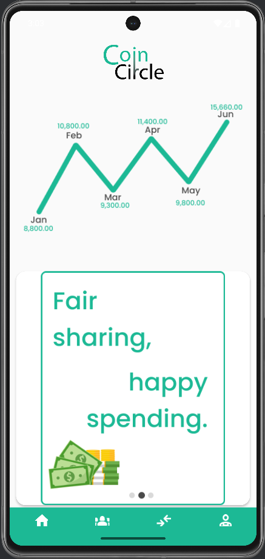
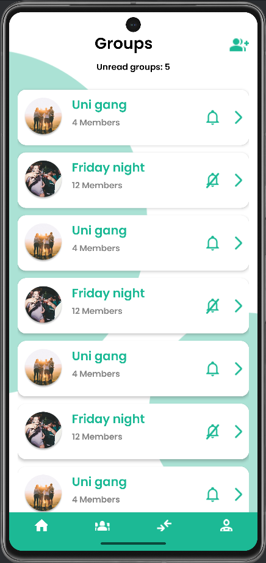
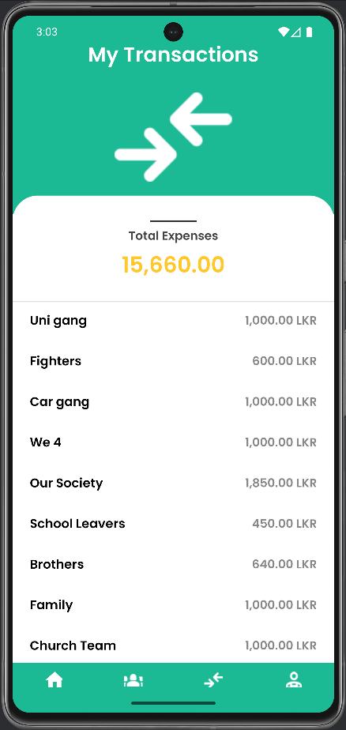
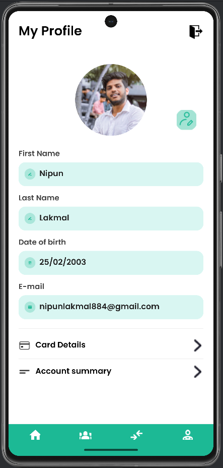

# Coin Circle - Budget & Expense Sharing App

Welcome to **Coin Circle**, a sleek and intuitive mobile app designed to simplify group expense management. Whether managing budgets for family, friends, roommates, or events, Coin Circle provides a seamless way to track shared expenses, balances, and transactions.

---

## Features

- **Group Management**: Create or join groups, invite friends, and manage group members effortlessly.
- **Expense Tracking**: Record contributions and payments within groups, with detailed transaction lists.
- **Personal Balances**: View your net balance in each group — know who owes or is owed.
- **Multiple Payment Methods**: Link debit or credit cards securely to streamline payments.
- **Beautiful & Responsive UI**: Modern design with smooth navigation optimized for all screen sizes.
- **Secure Login & Profile Management**: Manage your profile and authentication easily and securely.

---

## Screenshots

     

---

## Tech Stack

- **Language:** Kotlin
- **UI Components:** Jetpack Compose / XML layouts with Material Components
- **Libraries:**  
  - Material Components 
  - CircleImageView  
  - Intent Navigation 

---

## Installation

1. **Clone the repository**  
```bash
git clone https://github.com/nipun-munasinghe/coin-circle-mobile-app.git
cd coin-circle
```

2. **Open in Android Studio**  
Import the project and sync Gradle.

3. **Configure API keys & dependencies** (if any).

4. **Run on emulator or physical device**.

---

## Contribution

Contributions, issues, and feature requests are welcome!  
Feel free to fork the repository and open pull requests.

---

## License

This project is licensed under the MIT License - see the LICENSE file for details.

---

## Contact

Created with ❤️ by Nipun Lakmal (Me) – reach out via nipunlakmal884@gmail.com or connect on LinkedIn.

---

*Easily manage group expenses with Coin Circle — keeping your shared finances simple and transparent.*
